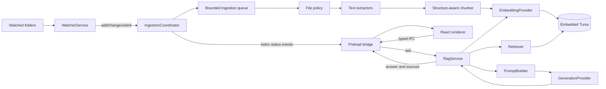

# PC Agent RAG Design

## 1. Purpose

PC Agent is an Electron desktop application that watches user-selected folders and builds a searchable local knowledge base from their contents. This document describes the target architecture for adding Retrieval Augmented Generation (RAG) using an embedded Turso database with vector search.

The design extends the existing folder-watching application without weakening its Electron security boundary:

- The Electron main process owns filesystem access, ingestion, Turso, retrieval, and AI provider credentials.
- The preload process exposes a narrow, typed, task-oriented API.
- The React renderer displays files, indexing state, conversations, answers, and citations. It does not access Node.js, Turso, or AI providers directly.

The implementation roadmap is maintained in `todo.md`.

## 2. Current system

The existing application already provides:

- A `WatcherService` backed by Chokidar.
- Validation and normalization of watched folder paths.
- Serializable file add, change, and removal events.
- A typed IPC contract exposed through `window.pcAgent`.
- A sandboxed renderer with context isolation enabled and Node integration disabled.
- Renderer state for listing, filtering, selecting, and inspecting watched files.
- Persistence of the active watched-folder list.

The current watcher stores file metadata only in memory. It does not yet extract text, persist documents, create embeddings, retrieve relevant content, or generate answers.

## 3. Goals

The RAG implementation will:

1. Incrementally index supported files from watched folders.
2. Persist document metadata, chunks, embeddings, and indexing state.
3. Detect unchanged content and avoid unnecessary extraction or embedding calls.
4. Retrieve semantically relevant chunks using Turso vector search.
5. Generate answers grounded in retrieved content.
6. Return verifiable, structured citations with every grounded answer.
7. Preserve the application's local-first behavior and explicit security boundaries.
8. Remain independent of any single embedding or generation provider.
9. Recover safely from application restarts, provider failures, and rapid filesystem changes.

## 4. Non-goals for the first release

The first RAG release will not:

- Support every document format.
- Depend on approximate nearest-neighbor vector indexing.
- Synchronize the knowledge base between devices.
- Allow the renderer to execute SQL or access arbitrary filesystem paths.
- Treat generated citation text as authoritative.
- Guarantee fully offline operation unless local embedding and generation providers are configured.
- Implement token streaming before non-streaming requests, cancellation, and cleanup are reliable.

## 5. Key assumptions

### 5.1 Application and runtime

- PC Agent remains a single-user Electron desktop application.
- Only the Electron main process opens the local Turso database.
- A single application instance is the expected writer to the knowledge-base database.
- Watched folders may contain inaccessible, malformed, binary, very large, or rapidly changing files.
- The application may be closed while files change, so startup reconciliation is required.

### 5.2 Database

- `@tursodatabase/database` is used for a local embedded database.
- The database is stored beneath Electron's per-user `app.getPath('userData')` directory.
- Embeddings are stored as Turso `vector32` values in a `BLOB` column.
- Text retrieval initially uses exact cosine-distance ordering through `vector_distance_cos`.
- Exact search may scan all stored chunk embeddings. It is acceptable for the initial personal knowledge-base scope but must be benchmarked as the index grows.
- The selected embedding model has a stable, known vector dimension.

### 5.3 AI providers

- Embedding and answer generation may be supplied by different providers.
- Cloud providers are optional but may receive extracted text when configured.
- Provider API keys are secrets and must never enter renderer state, IPC payloads, the knowledge-base database, or normal logs.
- Tests use deterministic fake providers and do not make paid network requests.

### 5.4 Content and retrieval

- Plain text and Markdown are the initial supported formats.
- PDF and DOCX support will be added after the core ingestion and retrieval flow is stable.
- Retrieval quality depends on extraction quality, chunk boundaries, the embedding model, and result selection.
- Retrieved documents are untrusted data and may contain prompt-injection instructions.
- A valid answer may be “insufficient relevant information” when retrieval does not find suitable evidence.

## 6. Architectural decisions

### 6.1 Keep all privileged RAG services in the main process

Filesystem access, Turso connections, secret storage, embedding requests, generation requests, and native file operations belong in the Electron main process.

This preserves the existing sandbox boundary and avoids exposing sensitive capabilities to renderer code. The renderer communicates only through typed use cases such as `ask`, `cancelAsk`, `getIndexState`, and `reindex`.

### 6.2 Keep the watcher independent from ingestion

`WatcherService` remains responsible for:

- Validating watched roots.
- Managing Chokidar lifecycle.
- Maintaining the current file metadata snapshot.
- Emitting serializable filesystem events.

An `IngestionCoordinator` consumes those events. It owns debouncing, job generations, extraction, chunking, embedding, and persistence. This separation keeps the watcher testable and prevents slow provider calls from becoming part of watcher lifecycle management.

### 6.3 Use a local-first embedded database

The database path will be:

```ts
join(app.getPath('userData'), 'knowledge-base.db')
```

One main-process database service opens the connection during application startup, applies versioned migrations, and closes it during shutdown.

Cloud synchronization is not part of the initial architecture. If required later, it will be an explicit opt-in design using an appropriate Turso synchronization package rather than an implicit behavior of the local knowledge base.

### 6.4 Replace a document's chunks atomically

Re-indexing creates the complete new representation before replacing the previously committed representation. The document upsert, deletion of old chunks, insertion of new chunks, and final status update occur in a transaction.

A failed extraction or embedding request must not leave a partially indexed document or silently destroy a previously valid index.

### 6.5 Use content and configuration fingerprints

File modification timestamps are insufficient for deciding whether to re-index. Each indexed document records:

- A content hash.
- Extractor and extraction-version identifiers.
- Chunker and chunking-version identifiers.
- Embedding provider, model, and dimensions.

Ingestion is skipped only when both content and relevant configuration match. Changing the embedding model or dimensions requires re-embedding affected chunks.

### 6.6 Use provider abstractions

Embedding and generation are separate interfaces:

```ts
interface EmbeddingProvider {
  readonly model: string
  readonly dimensions: number
  embed(texts: string[], signal?: AbortSignal): Promise<number[][]>
}

interface GenerationProvider {
  generate(request: GenerationRequest, signal?: AbortSignal): Promise<GenerationResult>
}
```

Repositories and orchestration depend on these interfaces instead of vendor SDKs. This supports test doubles, cloud providers, and future local models.

### 6.7 Use structured citations

The source of truth for citations is the retrieval result used to construct the prompt, not citation-like text generated by the model.

Every answer returns structured source records containing:

- Chunk and document identifiers.
- Canonical file path and display name.
- Heading, page, or source-offset metadata when available.
- A short excerpt.
- Retrieval rank and distance.

The renderer maps answer references to this source collection and displays source details separately.

### 6.8 Begin with exact vector retrieval

The initial retriever embeds the user's question and orders stored vectors by cosine distance:

```sql
SELECT
  c.id,
  c.document_id,
  c.content,
  c.heading,
  c.page_number,
  d.path,
  d.name,
  vector_distance_cos(c.embedding, vector32(?)) AS distance
FROM chunks c
JOIN documents d ON d.id = c.document_id
WHERE d.status = 'indexed'
ORDER BY distance ASC
LIMIT ?;
```

Retrieval is hidden behind an interface so that hybrid search, reranking, or approximate vector indexes can replace or augment exact search without changing `RagService` or renderer contracts.

## 7. Target component architecture



### 7.1 Planned main-process modules

```text
src/main/
  database/
    database.ts
    migrations.ts
    documentRepository.ts
    chunkRepository.ts
    conversationRepository.ts

  ingestion/
    ingestionCoordinator.ts
    ingestionQueue.ts
    filePolicy.ts
    extractText.ts
    chunkText.ts
    contentHash.ts
    extractors/
      plainText.ts
      markdown.ts
      pdf.ts
      docx.ts

  retrieval/
    retriever.ts
    resultDiversifier.ts
    contextSelector.ts

  ai/
    embeddingProvider.ts
    generationProvider.ts
    ragService.ts
    promptBuilder.ts
    providers/

  config/
    aiSettings.ts
    secretStore.ts

  ipc/
    validation.ts
```

Shared serializable RAG contracts belong in `src/shared/ragContracts.ts`.

## 8. Data model

### 8.1 Documents

One row represents one canonical file path.

Important fields:

- `id`
- `path`
- `root_path`
- `name`
- `mime_type`
- `size`
- `modified_at`
- `content_hash`
- `status`
- `error`
- `extractor_version`
- `chunker_version`
- `embedding_model`
- `embedding_dimensions`
- `indexed_at`
- `created_at`
- `updated_at`

Document status is expected to include:

- `queued`
- `extracting`
- `chunking`
- `embedding`
- `indexed`
- `skipped`
- `error`

Transient processing states may be held in memory and broadcast to the renderer. Durable terminal status and useful failure information are persisted.

### 8.2 Chunks

One document has ordered chunks.

Important fields:

- `id`
- `document_id`
- `ordinal`
- `content`
- `token_count`
- `start_offset`
- `end_offset`
- `heading`
- `page_number`
- `embedding`
- `embedding_model`
- `embedding_dimensions`
- `created_at`

The initial embedding column is a `BLOB` populated with `vector32(?)`.

### 8.3 Conversations

Conversation persistence is separated into:

- `conversations`
- `messages`
- `message_sources`

`message_sources` records the exact chunks supplied as evidence for a generated answer, including their rank and distance. This makes citations reproducible even if a file is later re-indexed.

## 9. Ingestion flow

### 9.1 Add or change

1. `WatcherService` emits an add or change event.
2. `IngestionCoordinator` assigns a new generation to the path.
3. The queue waits for file size and modification time to stabilize.
4. File policy rejects directories, unsupported formats, binary content, and files over configured limits.
5. The file is read and hashed.
6. Stored content and configuration fingerprints are compared.
7. Unchanged, compatible documents are skipped.
8. The selected extractor produces normalized text and source metadata.
9. The chunker creates deterministic, overlapping, structure-aware chunks.
10. The embedding provider embeds chunks in bounded batches.
11. Vector dimensions are validated.
12. The repositories atomically replace the document and chunks.
13. The coordinator broadcasts the final indexing state.

Before each expensive stage and before commit, the coordinator verifies that the job generation is still current.

### 9.2 Delete

1. The watcher emits `unlink`.
2. Pending work for the path is cancelled.
3. The document row is deleted.
4. Associated chunks are deleted by repository logic or foreign-key cascade.
5. The renderer receives the updated indexing state.

### 9.3 Startup reconciliation

Watcher events cannot report changes made while the application was closed. After startup, the ingestion coordinator compares active watched files with durable document records:

- New and changed files are enqueued.
- Missing files beneath active watched roots are removed.
- Unchanged compatible files are retained.
- Failed documents may be retried according to explicit retry policy.

### 9.4 Queue and retry behavior

- Jobs are deduplicated by canonical path.
- Newer path generations supersede older work.
- Initial document concurrency is deliberately low and configurable.
- Embeddings are batched according to provider limits.
- Transient provider failures receive bounded exponential backoff with jitter.
- Authentication, invalid-input, and unsupported-format errors do not retry indefinitely.
- Shutdown aborts provider requests and either drains or safely cancels pending work.

## 10. Chunking strategy

The initial chunker is deterministic and structure-aware:

- Target size: 500–800 model tokens.
- Overlap: 80–120 tokens.
- Preferred boundaries: headings, paragraphs, then sentences.
- Very small trailing chunks are merged where practical.
- Empty or trivial chunks are discarded.
- Source offsets and headings are preserved for citations.

Chunk IDs should be stable for identical document content and chunking configuration, for example by hashing the document identity, content hash, chunking version, and ordinal.

Token counting should use a tokenizer appropriate to the configured embedding model when available. A documented approximation may be used initially, but the context selector must remain conservative.

## 11. Query and answer flow

1. The renderer sends an `AskRequest` through the preload bridge.
2. The main process validates request length, filters, and request identity.
3. `RagService` embeds the question.
4. The retriever queries a wider candidate set from Turso.
5. Optional path, watched-root, or selected-document filters are applied in SQL.
6. The result selector removes duplicates and heavily overlapping adjacent chunks.
7. Results beyond the configured distance threshold are rejected.
8. The context selector chooses evidence within the generation model's token budget.
9. If no relevant evidence remains, the service returns an insufficient-context result without forcing generation.
10. `PromptBuilder` labels and delimits the selected evidence.
11. The generation provider produces a grounded answer.
12. The answer, usage metadata, and exact source records are persisted.
13. The renderer receives the answer and structured citations.

## 12. Prompt construction

The generated prompt must:

- State that retrieved text is untrusted evidence, not system instructions.
- Give each source a stable identifier.
- Delimit sources so their boundaries are unambiguous.
- Ask the model to use only provided evidence for knowledge-base claims.
- Require the model to acknowledge missing or conflicting evidence.
- Prohibit invented source identifiers.
- Reserve sufficient tokens for the answer.

Prompt injection cannot be solved by phrasing alone. The architecture therefore also prevents retrieved content from invoking tools, changing system behavior, executing SQL, or accessing the filesystem.

## 13. IPC contract

The preload bridge will expose task-level operations, conceptually:

```ts
interface PcAgentApi {
  // Existing watcher operations

  getIndexState(): Promise<IndexState>
  reindex(request: ReindexRequest): Promise<void>
  onIndexEvent(listener: (event: IndexEvent) => void): () => void

  ask(request: AskRequest): Promise<AskResponse>
  cancelAsk(requestId: string): Promise<void>

  getConversations(): Promise<ConversationSummary[]>
  getConversation(id: string): Promise<Conversation>
  deleteConversation(id: string): Promise<void>
}
```

The main process validates all payloads. Paths supplied through IPC must resolve beneath managed watched roots. No IPC method accepts SQL, provider credentials, arbitrary URLs, or unrestricted filesystem operations.

## 14. Security and privacy

### 14.1 Secrets

- Provider credentials are stored through operating-system credential storage.
- Credentials are never persisted in `settings.json` or the knowledge-base database.
- Credentials never cross the context bridge.
- Logs redact authorization data and provider request bodies.

### 14.2 Local and cloud data

The index is local by default. If a cloud embedding or generation provider is enabled, relevant extracted content leaves the device. The settings interface must disclose this before activation.

The application will not silently enable database synchronization. Future backup or multi-device sync must be explicit and documented.

### 14.3 Untrusted files

- Supported file types and size limits are allowlisted.
- Parser failures are isolated to the affected document.
- Paths are canonicalized and validated against managed roots.
- Symlink policy is explicit and consistently enforced.
- Retrieved content cannot invoke privileged application capabilities.
- Source contents, prompts, answers, and embeddings are excluded from routine logs.

### 14.4 Database encryption

Turso supports local encryption, but enabling it requires a defined key-storage, recovery, and rotation strategy. Encryption at rest is therefore a pending product and security decision, not an implicit initial setting.

## 15. Failure handling

Failures are classified so the renderer can present useful actions:

| Failure                            | Result                                                             |
| ---------------------------------- | ------------------------------------------------------------------ |
| Unsupported or binary file         | Mark skipped; do not retry automatically                           |
| File disappears during ingestion   | Cancel job and remove durable document                             |
| File changes during ingestion      | Supersede job with a newer generation                              |
| Extraction failure                 | Preserve prior valid index and record error                        |
| Transient provider failure         | Retry with bounded backoff                                         |
| Authentication failure             | Stop retrying and request configuration                            |
| Vector dimension mismatch          | Reject commit and require re-index/configuration fix               |
| Retrieval finds no relevant chunks | Return insufficient-context response                               |
| Generation failure                 | Preserve question and sources as appropriate; return a typed error |
| Migration failure                  | Do not start RAG services; surface a startup error                 |
| Shutdown during work               | Abort or drain without committing partial documents                |

## 16. Performance and scaling

The main scalability concern is exact vector retrieval. The implementation will:

- Benchmark retrieval at 10K, 50K, and 100K chunks.
- Record query latency, indexing duration, database size, and memory usage.
- Retrieve a wider candidate set but strictly bound final prompt context.
- Batch embedding calls.
- Avoid re-indexing unchanged content.
- Keep retrieval behind an interface.

If exact scans become unacceptable, the preferred evolution is:

1. Add lexical or metadata prefiltering.
2. Evaluate hybrid retrieval.
3. Add reranking when quality justifies its cost.
4. Adopt stable approximate vector indexing in the selected Turso deployment.

## 17. Packaging constraints

`@tursodatabase/database` contains native binaries. Packaged builds must verify:

- Linux x64 and ARM64.
- Windows x64.
- macOS ARM64.
- ASAR unpack behavior.
- Compatibility with Electron's runtime ABI.
- Whether `npmRebuild: false` remains appropriate.

The currently installed package does not declare a macOS x64 native binary. macOS x64 support must be resolved explicitly rather than assumed by the existing packaging matrix.

## 18. Testing strategy

### 18.1 Unit tests

- File policy and binary detection.
- Extractors and malformed inputs.
- Deterministic chunking and overlap.
- Content/configuration fingerprints.
- Queue deduplication, generations, cancellation, and retry decisions.
- Prompt construction and context budgeting.
- Retrieval result diversification.

### 18.2 Database integration tests

- Migrations and restart persistence.
- Document upsert and deletion.
- Atomic chunk replacement and rollback.
- Vector dimension validation.
- Exact cosine retrieval and filters.
- Conversation and source persistence.

Tests use temporary databases and do not modify the user's knowledge base.

### 18.3 Service tests

`RagService` tests use deterministic fake embedding, retrieval, and generation providers. They cover grounded answers, insufficient context, cancellation, provider errors, token-budget truncation, and citation mapping.

### 18.4 End-to-end tests

End-to-end coverage includes:

- Selecting a folder and completing initial indexing.
- Adding, modifying, and deleting files.
- Restart reconciliation.
- Asking a question and displaying citations.
- Retrying failed documents.
- Cancelling indexing and generation.
- Packaged application database loading on supported platforms.

## 19. Observability

Diagnostics should expose operational metadata without exposing user content:

- Document and chunk counts.
- Queue depth and current ingestion stage.
- Indexing and retrieval latency.
- Provider latency and categorized error counts.
- Database file size.
- Embedding model and dimensions.
- Migration version.

Source text, embeddings, prompts, answers, and credentials are excluded by default.

## 20. Open decisions

The following decisions require implementation research or product direction:

1. Which embedding and generation providers are used first?
2. Should local model providers be part of the first release or a later offline mode?
3. What are the initial maximum file size and knowledge-base size limits?
4. Should stopping a watched folder retain or remove its indexed documents?
5. What is the precise symlink policy?
6. Should conversation history be enabled by default?
7. Should the local database use encryption at rest, and how is its key recovered?
8. Is macOS x64 a supported release target?
9. When should lexical search, reranking, or approximate vector indexing be introduced?

These choices should not alter the fundamental process boundary or provider/retriever abstractions described above.
