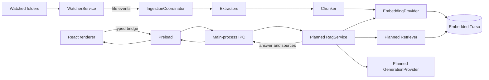

# Retrieval-augmented generation architecture

## Status

PC Agent currently implements the indexing half of the RAG system:

- Folder watching and restart restoration.
- Embedded Turso storage and versioned migrations.
- Local file policy, extraction, chunking, and ingestion reconciliation.
- Deterministic local embeddings stored as Turso vectors.
- Text, Markdown, DOCX, PPTX, XLSX, ODT, ODP, ODS, PDF, RTF, and EPUB extraction.

Semantic retrieval, answer generation, chat IPC, conversation persistence, citations, and the chat UI
remain planned. This document describes both the implemented foundation and the target architecture;
sections label planned behavior explicitly.

## Goals

1. Incrementally index supported files from user-selected folders.
2. Avoid repeat work when content and ingestion configuration are unchanged.
3. Retrieve relevant chunks using Turso vector distance.
4. Generate answers grounded in retrieved evidence.
5. Return structured, reproducible citations.
6. Preserve the sandboxed Electron boundary and local-first defaults.
7. Keep extraction, embedding, retrieval, and generation implementations replaceable.

## Key assumptions

- PC Agent is a single-user desktop application with one main-process database owner.
- Watched folders contain untrusted, malformed, inaccessible, large, or rapidly changing files.
- Changes can occur while the application is closed, so startup reconciliation is required.
- The default embedding provider remains local and credential-free.
- Future cloud providers may receive document text and therefore require explicit disclosure and
  secure credential storage.
- Exact cosine-distance retrieval is acceptable initially but must be benchmarked as the index grows.
- Retrieved content is untrusted evidence and may contain prompt-injection instructions.
- Returning “insufficient relevant information” is preferable to an unsupported answer.

## Process and trust boundaries

The main process owns filesystem access, Turso, native parsers, model providers, and credentials. The
preload exposes task-level operations only. The renderer is presentation-only and cannot directly
access Node.js, Electron, the database, watched paths, or provider credentials.

## Implemented components

### Application composition

`src/main/index.ts` opens `knowledge-base.db` below `app.getPath('userData')`, creates the embedding
provider and ingestion coordinator, routes watcher events into ingestion, reconciles on watcher ready,
and closes services during shutdown.

### Watcher

`src/main/watcher.ts` validates roots, owns one Chokidar watcher, maintains a metadata snapshot, and
emits serializable add/change/unlink events. It does not parse documents or access Turso.

### Database

`src/main/database/` owns:

- The single embedded Turso connection.
- Ordered migrations in `schema_migrations`.
- `documents` and `chunks` tables.
- Generalized page, slide, sheet, chapter, and section metadata.
- Transactional replacement of a document and all its chunks.

The database is local only. Cloud synchronization and encryption-at-rest key management are not yet
implemented.

### Ingestion

`src/main/ingestion/` owns file classification, extraction, chunking, fingerprints, the bounded queue,
and restart reconciliation. Work is keyed by canonical path; a newer generation cancels and supersedes
older work.

The file policy currently rejects symlinks, non-files, ignored directories, unsupported extensions,
unreadable files, invalid UTF-8 text, and input files over 10 MB. OfficeParser additionally applies
archive and spreadsheet resource limits.

### Embeddings

`src/main/ai/embeddingProvider.ts` defines the provider contract, validates results, batches requests,
and retries classified transient failures. The current `LocalHashEmbeddingProvider` maps normalized
tokens into a deterministic 384-dimensional vector. It is a private, credential-free baseline, not a
claim of production semantic quality.

## Ingestion lifecycle

For an add or change event:

1. Assign a new generation to the canonical path.
2. Wait for file size and modification time to stabilize.
3. Apply file type, path, symlink, readability, and size policies.
4. Hash file bytes and compute an ingestion-configuration fingerprint.
5. Skip the file when content and configuration match the durable record.
6. Extract normalized text and source sections.
7. Produce deterministic structure-aware chunks.
8. Generate embeddings in bounded batches.
9. Recheck cancellation and generation freshness.
10. Transactionally replace the document and its chunks.

For deletion, pending work is cancelled and the durable document is removed. On startup, current
watched files are compared with durable documents so missed changes are repaired.

## Data model

`documents` stores canonical path, watched root, media type, file metadata, content/configuration
fingerprints, indexing status, sanitized failure information, and timestamps.

`chunks` stores document ownership, stable order, normalized content, token estimate, offsets,
heading/source metadata, embedding bytes, provider/model identity, dimensions, and creation time.

Planned retrieval/chat work adds conversations, messages, and immutable message-source snapshots or
equivalent evidence records. Citation history must not silently change when a source document is later
re-indexed.

## Planned retrieval and answer flow

1. Validate the question and optional source filters in the main process.
2. Embed the question with the same compatible embedding configuration used for chunks.
3. Query a wider candidate set ordered by `vector_distance_cos`.
4. Apply root/document filters in SQL and reject results beyond a configurable threshold.
5. Remove duplicate and heavily overlapping adjacent chunks.
6. Select evidence within a conservative context-token budget.
7. Return an insufficient-context result when no suitable evidence remains.
8. Delimit and label untrusted evidence in a grounded prompt.
9. Invoke a provider-neutral `GenerationProvider`.
10. Persist the answer and exact evidence, then return structured citations.

Retrieval remains behind an interface so hybrid lexical search, reranking, or approximate vector
indexes can be introduced without changing the renderer contract.

## Planned IPC surface

New preload operations will remain task-oriented:

- Read index and per-document state.
- Subscribe to indexing events.
- Re-index selected documents or active roots.
- Ask and cancel a question using a request identifier.
- Read and delete conversations.
- Reveal a validated cited file through a separate native operation.

No IPC method will accept arbitrary SQL, unrestricted paths, credentials, or provider SDK objects.

## Design decisions

- Use embedded Turso for local durable state; see ADR-001.
- Keep privileged RAG capabilities in the main process; see ADR-002.
- Use a constrained OfficeParser adapter for structured formats; see ADR-003.
- Keep watcher and ingestion responsibilities separate.
- Replace chunks atomically so failed indexing preserves the previous valid index.
- Fingerprint content plus extractor, chunker, and embedding configuration.
- Treat structured retrieval records, not model-written citation markup, as citation truth.
- Start with exact cosine-distance retrieval and benchmark before adding complexity.

All three ADRs are currently `Proposed` because the framework requires explicit approval for the
protected datastore, external dependency, and cross-component ownership choices.

## Failure and recovery policy

| Failure                                   | Required behavior                                      |
| ----------------------------------------- | ------------------------------------------------------ |
| Unsupported/binary/symlink/oversized file | Mark skipped; do not retry indefinitely                |
| File changes during work                  | Cancel and supersede with the newer generation         |
| File disappears                           | Cancel work and remove its durable record              |
| Extraction or embedding failure           | Keep the prior valid index and store a sanitized error |
| Vector dimension mismatch                 | Reject the replacement                                 |
| No relevant retrieval result              | Return insufficient context                            |
| Migration failure                         | Do not start indexing; show a startup error            |
| Shutdown during work                      | Abort or drain without committing a partial document   |

## Scaling and packaging constraints

- Benchmark exact retrieval at 10K, 50K, and 100K chunks.
- Track indexing duration, retrieval latency, database size, and memory without logging content.
- Verify native Turso and OfficeParser assets in packaged Linux, Windows, and macOS builds.
- Confirm ASAR behavior and Electron native-module compatibility.
- Resolve macOS x64 support explicitly; do not infer it from the existing packaging matrix.

## Open decisions

1. Which generation provider is implemented first?
2. Is a stronger local embedding model required before retrieval ships?
3. What distance threshold and context limits provide acceptable quality?
4. Does stopping a watched root retain or remove its durable index?
5. Should conversation history be enabled by default?
6. Is database encryption at rest required, and how is its key recovered?
7. Is macOS x64 a supported release target?
8. When do hybrid retrieval, reranking, or approximate vector indexing become justified?

## Related plans and operations

- `tasks/active/rag-retrieval-and-chat.md` covers the core retrieval and chat implementation.
- `tasks/active/rag-security-reliability-and-future.md` covers configuration, privacy, diagnostics,
  recovery, format evaluation, end-to-end verification, and deferred enhancements.
- `tasks/active/indexing-release-verification.md` covers remaining extractor fixtures and architecture
  approval.
- `docs/release-checklist.md` defines platform and packaged-runtime verification.
