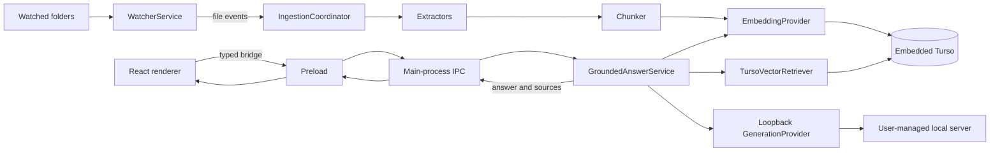

# Retrieval-augmented generation architecture

## Status

PC Agent currently implements the indexing, retrieval, orchestration-contract, and persistence
foundations of the RAG system:

- Folder watching and restart restoration.
- Embedded Turso storage and versioned migrations.
- Local file policy, extraction, chunking, and ingestion reconciliation.
- Deterministic local embeddings stored as Turso vectors.
- Text, Markdown, DOCX, PPTX, XLSX, ODT, ODP, ODS, PDF, RTF, and EPUB extraction.
- Exact compatible-vector retrieval and bounded evidence selection.
- Provider-neutral generation with structured citations for document-grounded answers and an
  explicitly labeled model-knowledge fallback when no usable evidence remains.
- A loopback-only OpenAI-compatible generation provider with persistent bounded settings.
- Typed ask, cancel, settings, conversation read/list/delete IPC and a chat UI that displays grounding.
- Durable conversations, messages, grounding classifications, and immutable citation snapshots
  retained until explicit deletion.

Index-state/re-index/reveal IPC, the indexing UI, and local retrieval benchmarks are implemented.
Broader installed-package and cross-platform verification remains planned.

## Goals

1. Incrementally index supported files from user-selected folders.
2. Avoid repeat work when content and ingestion configuration are unchanged.
3. Retrieve relevant chunks using Turso vector distance.
4. Generate answers grounded in retrieved evidence when available, with a clearly identified
   model-knowledge fallback otherwise.
5. Return structured, reproducible citations.
6. Preserve the sandboxed Electron boundary and local-first defaults.
7. Keep extraction, embedding, retrieval, and generation implementations replaceable.

## Key assumptions

- PC Agent is a single-user desktop application with one main-process database owner.
- Watched folders contain untrusted, malformed, inaccessible, large, or rapidly changing files.
- Changes can occur while the application is closed, so startup reconciliation is required.
- The default embedding provider remains local and credential-free.
- Future cloud providers may receive document text and therefore require explicit disclosure and
  secure credential storage.
- Exact cosine-distance retrieval is acceptable initially but must be benchmarked as the index grows.
- Retrieved content is untrusted evidence and may contain prompt-injection instructions.
- Answers without relevant indexed evidence must be identified as ungrounded and must not claim to
  come from the user's files.

## Process and trust boundaries

The main process owns filesystem access, Turso, native parsers, model providers, and credentials. The
preload exposes task-level operations only. The renderer is presentation-only and cannot directly
access Node.js, Electron, the database, watched paths, or provider credentials.

## Implemented components

### Application composition

`src/main/index.ts` opens `knowledge-base.db` below `app.getPath('userData')`, creates the embedding
provider and ingestion coordinator, routes watcher events into ingestion, reconciles on watcher ready,
and closes services during shutdown.

### Watcher

`src/main/watcher.ts` validates roots, owns one Chokidar watcher, maintains a metadata snapshot, and
emits serializable add/change/unlink events. It does not parse documents or access Turso. Root paths
and directory-symlink traversal is disabled. Ingestion canonicalizes each descendant immediately
before access and reads one bounded snapshot.

### Database

`src/main/database/` owns:

- The single embedded Turso connection.
- Ordered migrations in `schema_migrations`.
- `documents` and `chunks` tables.
- `conversations`, `messages`, and immutable `message_citations` snapshots.
- Generalized page, slide, sheet, chapter, and section metadata.
- Transactional replacement of a document and all its chunks.

The database is local only. Cloud synchronization and encryption-at-rest key management are not yet
implemented.

### Ingestion

`src/main/ingestion/` owns file classification, extraction, chunking, fingerprints, the bounded queue,
and restart reconciliation. Work is keyed by the watcher event path; a newer generation aborts older
work, and mutations share a serialized boundary that rechecks generation and active-root membership.

The file policy currently rejects a symlink in the final path component, non-files, ignored
directories, unsupported extensions, unreadable files, invalid UTF-8 text, and input files over 10 MB.
Intermediate directory symlinks, final symlinks, inode swaps, and canonical targets outside the active
root are rejected. OfficeParser additionally applies archive and spreadsheet resource limits.

### Embeddings

`src/main/ai/embeddingProvider.ts` defines the provider contract, validates results, batches requests,
and retries classified transient failures. The current `LocalHashEmbeddingProvider` maps normalized
tokens into a deterministic 384-dimensional vector. It is a private, credential-free baseline, not a
claim of production semantic quality.

## Current ingestion lifecycle

For an add or change event:

1. Assign a new generation to the watcher event path.
2. Wait for file size and modification time to stabilize.
3. Apply file type, path, symlink, readability, and size policies.
4. Hash file bytes and compute an ingestion-configuration fingerprint.
5. Skip the file when content and configuration match the durable record.
6. Extract normalized text and source sections.
7. Produce deterministic structure-aware chunks.
8. Generate embeddings in bounded batches.
9. Recheck cancellation, generation freshness, and active-root membership inside the serialized
   mutation boundary.
10. Transactionally replace the document and its chunks.

For deletion, pending work is cancelled and the durable document is removed. On startup, current
watched files are compared with durable documents so missed changes are repaired.

Deletion and reconciliation use the same serialization boundary. Successful empty/non-indexable
replacements atomically clear prior chunks, while extraction or embedding failures retain prior chunks
under a non-indexed document status.

## Remaining integrity and security verification

Canonical containment, snapshot consistency, serialized freshness/deletion, zero-chunk replacement,
IPC sender validation, and navigation denial are implemented. Remaining verification includes broader
path-swap/platform cases, additional interruption interleavings, and installed Windows/macOS package
checks. Work is tracked by IDX-001/002/004/005, HARD-003, and RAGX-004.

## Data model

`documents` stores canonical path, watched root, media type, file metadata, content/configuration
fingerprints, indexing status, sanitized failure information, and timestamps.

`chunks` stores document ownership, stable order, normalized content, token estimate, offsets,
heading/source metadata, embedding bytes, provider/model identity, dimensions, and creation time.

`conversations` and `messages` retain local history and each assistant message's grounding
classification until explicit deletion. `message_citations` stores immutable evidence snapshots so
citation history does not change when a source is later re-indexed.

## Retrieval and answer flow

1. Validate the question and optional source filters in the main process.
2. Embed the question with the same compatible embedding configuration used for chunks.
3. Query a wider candidate set ordered by `vector_distance_cos`.
4. Apply root/document filters in SQL and reject results beyond a configurable threshold.
5. Remove duplicate and heavily overlapping adjacent chunks.
6. Select evidence within a conservative context-token budget.
7. When suitable evidence remains, delimit and label it as untrusted data in a grounded prompt.
8. Otherwise, request a general model-knowledge answer with citations disabled.
9. Invoke a provider-neutral `GenerationProvider`.
10. Atomically persist the answer, grounding classification, and exact evidence; return structured
    citations only for evidence-backed answers.

Steps 1–10 are composed at runtime with the approved user-managed local server provider. Generation
is disabled by default and can only target HTTP(S) on `localhost`, `127.0.0.1`, or `[::1]`. Requests
are non-streaming, bounded, cancellable, credential-free, and reject redirects.
The provider requests a strict JSON schema requiring an answer and citation array, validates the
returned shape again locally, and reports invalid responses separately from server availability
failures.

Retrieval remains behind an interface so hybrid lexical search, reranking, or approximate vector
indexes can be introduced without changing the renderer contract.

## IPC surface

Implemented preload operations remain task-oriented:

- Read and update bounded local generation settings.
- Ask and cancel a question using an opaque request identifier.
- Read, list, and delete conversations.
- Read aggregate and per-document index state.
- Re-index active roots and retry a document by opaque identifier.
- Reveal a currently indexed citation only after database, active-root, symlink, and canonical-path
  validation.
- Read, clear, and export content-free local diagnostic aggregates.

Still planned:

- Push indexing-event subscription; the current UI serially polls snapshots containing complete
  aggregate counts and at most 200 recently updated document records.

No IPC method will accept arbitrary SQL, unrestricted paths, credentials, or provider SDK objects.

## Local diagnostics policy

Operational diagnostics are aggregate and local only. They record document/chunk counts, queue depth,
document stages, database size, categorized operation outcomes, and timing for ingestion, embedding,
retrieval, and generation. They never retain document text, embeddings, prompts, answers, credentials,
parser payloads, or filenames. Aggregates live only in memory until explicit clearing or application
restart. A user may export the same redacted snapshot to JSON through a native save dialog. Telemetry
is disabled and there is no remote transmission path.

## Design decisions

- Use embedded Turso for local durable state; see ADR-001.
- Keep privileged RAG capabilities in the main process; see ADR-002.
- Use a constrained OfficeParser adapter for structured formats; see ADR-003.
- Use a user-managed loopback OpenAI-compatible generation server; see ADR-004.
- Keep watcher and ingestion responsibilities separate.
- Replace chunks atomically so failed indexing preserves the previous valid index.
- Treat canonical containment and commit freshness as database-ingestion invariants, not best-effort
  preflight checks.
- Clear prior chunks atomically when successful processing determines that current content is empty or
  otherwise non-indexable.
- Fingerprint content plus extractor, chunker, and embedding configuration.
- Treat structured retrieval records, not model-written citation markup, as citation truth.
- Start with exact cosine-distance retrieval and benchmark before adding complexity.

ADR-001, ADR-002, ADR-003, and ADR-004 were explicitly approved on 2026-10-03.

## Failure and recovery policy

| Failure                                    | Required behavior                                      |
| ------------------------------------------ | ------------------------------------------------------ |
| Unsupported/binary/symlink/oversized file  | Mark skipped; do not retry indefinitely                |
| Canonical target leaves an active root     | Reject access and do not persist or expose the target  |
| Successful empty/non-indexable replacement | Clear prior chunks and retain a non-indexed status     |
| File changes during work                   | Cancel and supersede with the newer generation         |
| File disappears                            | Cancel work and remove its durable record              |
| Stale generation reaches commit            | Reject the mutation inside the serialized commit       |
| Extraction or embedding failure            | Keep the prior valid index and store a sanitized error |
| Vector dimension mismatch                  | Reject the replacement                                 |
| No relevant retrieval result               | Generate and clearly label an ungrounded model answer  |
| Migration failure                          | Do not start indexing; show a startup error            |
| Shutdown during work                       | Abort or drain without committing a partial document   |
| Normal application shutdown                | Preserve durable documents/chunks and configured roots |

## Scaling and packaging constraints

- Benchmark exact retrieval at 10K, 50K, and 100K chunks.
- Track indexing duration, retrieval latency, database size, and memory without logging content.
- Verify native Turso and OfficeParser assets in packaged Linux, Windows, and macOS builds.
- Confirm ASAR behavior and Electron native-module compatibility.
- Resolve macOS x64 support explicitly; do not infer it from the existing packaging matrix.

## Open decisions

1. Is a stronger local embedding model required before retrieval ships?
2. What distance threshold and context limits provide acceptable quality?
3. Should conversation history remain enabled by default?
4. Is database encryption at rest required, and how is its key recovered?
5. Is macOS x64 a supported release target?
6. When do hybrid retrieval, reranking, or approximate vector indexing become justified?

## Related plans and operations

- `tasks/active/rag-retrieval-and-chat.md` covers the core retrieval and chat implementation.
- `tasks/active/rag-security-reliability-and-future.md` covers configuration, privacy, diagnostics,
  recovery, format evaluation, end-to-end verification, and deferred enhancements.
- `tasks/active/indexing-release-verification.md` covers containment and commit-integrity hardening,
  remaining encrypted-document coverage, and packaged verification.
- `docs/release-checklist.md` defines platform and packaged-runtime verification.
